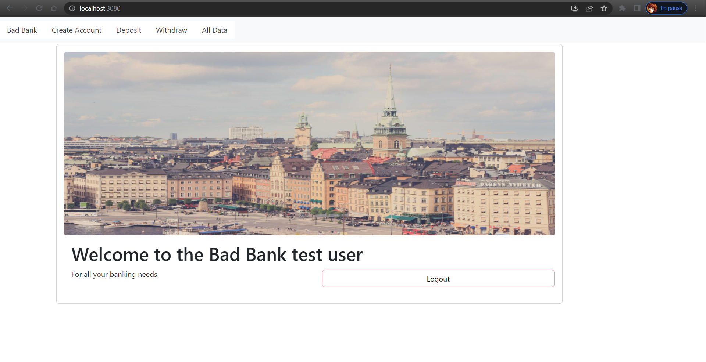

# Bad bank exercise

# Description

This is the Bad Bank exercise for MITxPro bootcamp. It was built as an example of the integration for a MERN system.

# Install

* Clone the project with git clone with HTTPS or SSH
* Run npm install / yarn install in the root directory
* Run node index.js to open the system in port 3080

# How it looks

# Tech used

* Front-end ->  React
* Back-end -> Express / nodeJS
* DB -> MongoDB

# Features

* Login / Logout
* Register
* Deposit / Withdraw of imaginary money
* Show balance of money per user
* Show all users

## Features to come

* Validations

# Licence

*MIT